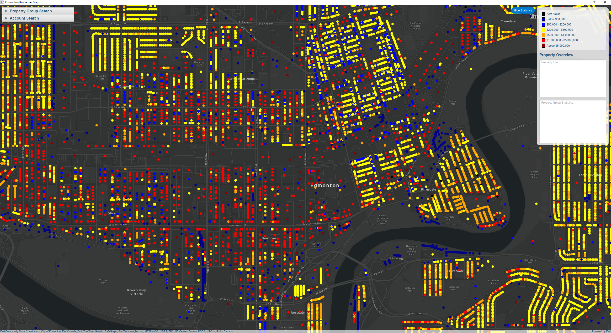

# CMPT305 Edmonton Housing Group Project

## Instructions

### IntelliJ IDEA

# For first time use.
Select File > Project Structure... and ensure that the Project SDK and language level are set to use `Java 17`.
In the Maven view, under Plugins > dependency, double-click the `dependency:unpack` goal. This will unpack the native libraries into $USER_HOME/.arcgis.

# Running after unpacking 
1. Open IntelliJ IDEA and select _File > Open..._.
2. Choose the java-maven-starter-project directory and click _OK_.
3. Open the Maven view with _View > Tool Windows > Maven_.
4. In the Maven view, run the `compile` phase under _Lifecycle_ and then the `exec:java` goal to run the app.

## Issues

- Some map points are not being faded when a single map point is highlighted
- The program freezes at some points during loading of the data

## Contributing

Scott MacAulay - https://github.com/John-smith088

Michael Dinelle - https://github.com/michaelDinelle

Brighton Gosinet - https://github.com/BrightonGosinet

Matt English - https://github.com/Menglish025

## Resources

* [ArcGIS Maps SDK for Java](https://developers.arcgis.com/java/)

